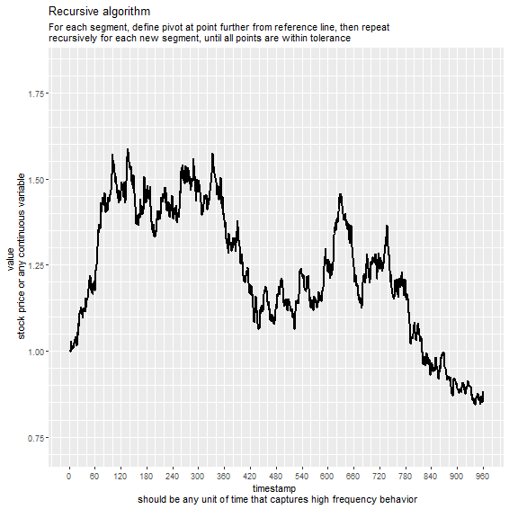

Stock data reduction via identification of “pivot points”
================

# TLDR

#### (*Too Long, Didn’t Read or the contents of your typical README.md file*)

This project implements a method for simplifying and reducing time
series data via the identification of “pivot points” (defined here as a
series of points selected from the data which determine a set of line
segments from which the actual data does not deviate more than a given
tolerance).

Two different algorithms are presented for calculating these points,
depending on whether the full time series is available or if the points
are being calculated in real time.

It is assumed that the representation of the actual data via these
“pivot points” is more advantageous for certain applications than the
full data (particularly for stock market price prediction, trend
identification and recognition of patterns).

The following files are contained in the repository:

  - A .R script implementing functions for finding the pivot points and
    for generating randomized stock data for testing.
  - .R scripts for creating animations to illustrate features of each of
    the algorithms used for calculation of the pivot points.
  - An images folder, where the scripts that create animations save the
    temporary .png and the resulting .gif files and from which this
    report uses the images.

If you want to replicate this analysis, you can clone this repository
and either 1) run the declaration\_of\_functions.R script to be able to
use the find.pivot() and rstock() functions or 2) run the animate
scripts to create animations based on randomly generated stock data.

The remainder of this file contains a detailed discussion of the
implementation and characteristics. Animated gifs illustrate the
algorithms and results.

# Introduction

## Motivation and goals

The methods developed here were motivated by difficulties encountered in
previous attempts to write scripts with explicit rules for making
buy/sell decisions in the stock market.

Due to the highly dynamic nature of the price signals involved, the
identification of patterns in the data is a complex task, which renders
the definition of rules based on prominent features very difficult.

The usual solution to the problem of dealing with highly noisy price
data is the use of longer price candles. However, this method presents a
shortcoming in that it is not sensitive to varying levels of market
volatility (since each candle represents the same amount of time).

In order to deal with these problems, the goal of this project is to
define algorithms that reduce the data so that:

  - The reduced time series is comprised of a minimal set of points
    (“pivot points”) selected from the original data
  - The points in the reduced data determine a set of line segments that
    represent the most prominent features (such as peaks and valleys) of
    the original data
  - The original data falls within a specified tolerance around the line
    segments  
  - The reduced data is sensitive to different levels of volatility in
    the original data

## Expected advantages

As a hypothesis (to be confirmed in a posterior analysis), 3 different
advantages are expected from the use of this reduction technique:

  - **Easier to identify relationships:** Through analytic comparison of
    the pivot points for different stocks, patterns and relationships
    will be identified more easily than from the raw price data. For
    instance, companies whose price follow the same industry trends will
    have that feature readily identifiable from the pivot points
    reduction.
  - **More efficient trend identification:** The data obtained by the
    reduction to pivot points present the bare essentials of the price
    history and its prominent features, exempt from noise and day-to-day
    market volatility. It is expected that this will be a more robust
    set of data for algorithms attempting to predict future prices with
    extended time ranges, since the data will be closer to the features
    considered in a fundamentalist analysis.
  - **Precise market volatility indication:** The density of pivot
    points is highly related with market volatility. It is expected that
    a histogram showing the daily concentration of pivot points for
    multiple stocks over time will be a precise indicator of market
    volatility and relevant predictor of future behavior.

# The technique

Two different algorithms were developed to identify the pivot points for
a given time series, depending on whether or not the full data is
available at the time of calculation:

  - **Recursive algorithm:** when the entire data series is available,
    the algorithm is able to identify the most prominent features in the
    data and set the pivot points accordingly. This version tends to be
    more precise in the definition of points, thus requiring less points
    to characterize the data.
  - **Sequential algorithm:** when the data becomes available one day
    (or other unit of time) at a time, past pivot points are fixed and
    the algorithm only decides if a new pivot point needs to be added.
    This version tends to require more points, but can be used for real
    time calculation as each new data point becomes available.

We now detail the two algorithms and illustrate their results.

## Recursive algorithm

As stated above, this approach requires knowledge of the entire data set
at the time of calculation.

These are its steps:

> 1.  Define interval under analysis as the full interval between first
>     and last available points
> 2.  Draw reference line segment between the two points
> 3.  Evaluate deviation between all the values in the segment and the
>     reference line
> 4.  If any point deviates more than the specified tolerance, the point
>     where the highest deviation is found will be defined as a pivot
>     point
> 5.  For each new pivot point added, run steps 2-4 to recursively
>     evaluate the two segments defined by cutting the interval defined
>     in step 1 at the new pivot point

The animation below illustrates the calculation for several randomly
generated stocks. They each cover a period of 960 days (roughly 4 years
of daily prices), and each frame represents one iteration of the
recursive process. The red points and line segments represent the pivot
points and respective price approximation, and the green band represents
the tolerance. The tolerance for all the examples is 10%.



From the images, it is evident that, given the 10% tolerance, a set of
around 20 points is normally sufficient to represent the full set of 960
points in the original data.

## Sequential algorithm

In order to deal of the limitation of the recursive algorithm, namely
that the entire data set must be known at the time of calculation, the
sequential approach was developed.

In this method, the set of past pivot points is not affected by the
addition of new data. All the algorithm does is evaluate whether the new
point requires the creation of a new pivot point in order to keep all
the original data within the specified tolerance.

These are the algorithm steps:

> 1.  Define interval under analysis (will begin at last pivot point and
>     end at current value, if there is no last point, will use the
>     first point in the time series)
> 2.  Draw reference line segment between the two points
> 3.  Evaluate deviation between all the values in the segment and the
>     reference line
> 4.  If any point deviates more than the tolerance, the point where the
>     highest deviation is found will be defined as a pivot point
> 5.  For each new value, repeat steps 1-4

The algorithm can be seen in action in the animation below. Here, the
blue error bar at the last segment in each frame represents the current
pivot point candidate, which is the point that further deviates from the
reference line. This point is added to the list of pivot points when the
deviation is larger than the given tolerance.


The obvious advantage with this approach is that the algorithm can be
applied *ad eternum*, as new pivot points are simply added to the
running list. The following animation illustrates this feature:


## The find.pivot() function

The find.pivot() function, offered in the declaration\_of\_functions.R
file in this repository, implements both the algorithms described above.
We now illustrate its use, along with the rstock() function, which
creates a mock stock time series for testing purposes.

The following code creates mock stock data for 480 days (approximately 2
years):

``` r
# create mock stock data
stock <- 
  rstock(duration = 480, # amount of data points to be created
         exp_yield = 1, # expected value for stock yield per year
         se_yield = .015) # daily standard error for random price change

# display beginning of stock data
head(stock)
##   day    value
## 1   1 1.000000
## 2   2 1.014545
## 3   3 1.021656
## 4   4 1.047395
## 5   5 1.029041
## 6   6 1.011906

# display end of stock data
tail(stock)
##     day    value
## 475 475 1.219590
## 476 476 1.216666
## 477 477 1.193699
## 478 478 1.232397
## 479 479 1.222001
## 480 480 1.259503
```

Then, pivot points are calculated with the recursive algorithm:

``` r
# create pivot points with recursive method
pivot.points.recursive <- 
  find.pivot(x = stock$day, # vector with the time stamp
             y = stock$value, # vector with the value for each day
             tolerance = .10, # accepted deviation of the original data around line segments
             mode = "Recursive") # mode selected for calculation

# print pivot points obtained with recursive method
pivot.points.recursive
##   pivot     value   inclination
## 1     1 1.0000000  0.0009409119
## 2   105 1.0978548 -0.0035574511
## 3   150 0.9377695  0.0110794640
## 4   167 1.1261204  0.0018221558
## 5   322 1.4085546 -0.0067947769
## 6   373 1.0620209 -0.0003994951
## 7   407 1.0484381  0.0093674910
## 8   437 1.3294628 -0.0016269645
## 9   480 1.2595034 -0.0016269645
```

Finally, pivot points are calculated with the sequential algorithm:

``` r
# create pivot points with sequential method
pivot.points.sequential <- 
  find.pivot(x = stock$day, # vector with the time stamp
             y = stock$value, # vector with the value for each day
             tolerance = .10, # accepted deviation of the original data around line segments
             mode = "Sequential") # mode selected for calculation

# print pivot points obtained with sequential method
pivot.points.sequential
##    pivot     value   inclination
## 1      1 1.0000000  0.0009409119
## 2    105 1.0978548 -0.0035574511
## 3    150 0.9377695  0.0110794640
## 4    167 1.1261204 -0.0024412595
## 5    190 1.0699715  0.0092024107
## 6    209 1.2448173  0.0014490028
## 7    322 1.4085546 -0.0072529939
## 8    366 1.0894228 -0.0009996274
## 9    407 1.0484381  0.0093674910
## 10   437 1.3294628 -0.0016269645
## 11   480 1.2595034 -0.0016269645
```

We see that there is a significant reductions in the quantity of points
required to describe the stock prices over the 2 year period. For a 10%
tolerance, we observe the both algorithms typically require around 5
pivot points per year (\~240 individual data points) worth of data.

We also note that the set of pivot points calculated with each of the
algorithms is not the same, despite having several shared points. The
following code illustrates this:

``` r
# find points that are common to both calculation methods
list <- pivot.points.sequential$pivot %in% pivot.points.recursive$pivot

# print list of common points
pivot.points.sequential$pivot[list]
## [1]   1 105 150 167 322 407 437 480
```

# Conclusion

The method presented in this report allows for the simplified
representation of stock market data and other time series data in a
compact, precise and feature-rich manner. Both algorithms are offered as
R functions that can be easily applied to time series data.

As an attempt to confirm the expected advantages of the method and to
further the project, some next steps are identified:

  - Run on full or significant portion of stock market history.
  - Attempt to identify patterns in volatility and link to significant
    events.
  - Attempt to cluster different stocks into sectors by finding
    correlations.
  - Attempt to predict next pivot points from historical data (train
    with all, predict with one stock plus combination of pivot points
    for index & pivot points for sector).
  - Evaluate statistical distribution of distance between pivot points
    and histogram of pivot points over time and develop indicator of
    market volatility.
  - Evaluate how tweaks to the tolerance value (from the 10% deviation
    in the demonstrations above) and calculation method (include
    absolute, time-dependent, deviation from arch/curve or
    Taylor/Fourier approximations) alter the pivot points density and
    other features of the data reduction.
  - Combine use of different tolerances (high for old data, low for
    analysis of current segment)
  - Share functions as package on GitHub.
